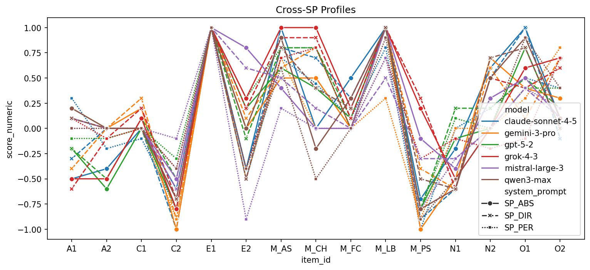

# SoulBench SNAP v3.1

SoulBench SNAP est un pipeline experimental Python pour collecter, scorer,
analyser et visualiser des reponses de LLM sous variations controlees de
contexte.

Le projet ne cherche pas a inferer une personnalite ou des valeurs
intrinseques chez les modeles. Il mesure des profils de reponse conditionnes
par un protocole de prompting, puis teste si ces profils sont assez stables,
scorables et peu sensibles au contexte pour justifier une campagne plus large.

## Statut v3.1

Le POC v3.1 a ete execute de bout en bout. Le resultat final est:

```text
FAIL
```

Ce `FAIL` est scientifique/protocolaire, pas technique. La collecte, le
scoring, l'adjudication, les analyses, les figures et la decision automatisee
fonctionnent. Le protocole echoue parce que deux seuils de stabilite ne sont
pas atteints:

| Check | Valeur | Seuil | Statut |
|---|---:|---:|---|
| Kappa inter-juges | 0.7509 | 0.60 cible | pass |
| Taux de refus | 0.00074 | 0.10 max | pass |
| Desaccords majeurs initiaux | 0.0089 | 0.15 max | pass |
| Split-half min | 0.8827 | 0.60 min | pass |
| ICC min | 0.5486 | 0.60 min | fail |
| Cross-SP corr min | 0.3189 | 0.60 min | fail |

Interpretation courte: le pipeline est pret, mais le protocole v3.1 revele une
sensibilite trop forte a certains prompts systeme, surtout `SP_PER`, pour
passer directement a une campagne plus large.

## Artefacts conserves sur main

La branche principale conserve maintenant le kit v3.1 utile pour comprendre,
relire et reproduire les analyses principales:

- `config/`: modeles, items, prompts systeme, rubriques, protocole actif.
- `src/`: pipeline collecte/scoring/analyse/visualisation/decision.
- `tests/`: tests unitaires.
- `PROTOCOLE_EXPERIMENTAL_SNAP_v1_1.md`: design POC source.
- `PROTOCOLE_EXPERIMENTAL_SNAP_v2_1.md`: design full-factorial historique.
- `PROTOCOLE_EXPERIMENTAL_SNAP_v3_1.md`: protocole actif du POC execute.
- `POC_v3_1_summary.md`: synthese methodologique et resultats.
- `data/snap_poc_v3_1.db`: base finale collecte + scoring + adjudication.
- `data/snap_poc_v3_1_human_validation_clean.db`: base clean pour validation humaine.
- `data/manual_sample_coded.csv`: echantillon humain code, 200 lignes.
- `outputs/reports/`: rapports JSON/CSV finaux.
- `outputs/figures/`: figures PNG finales.

Les artefacts volontairement exclus de `main` sont les logs de collecte
OpenRouter, les anciennes DB intermediaires/legacy, la DB working mixte, le CSV
manuel non code, les caches Python, `.DS_Store`, `.venv` et les fichiers SQLite
`-wal/-shm`.

Un snapshot plus complet, avec les artefacts lourds historiques avant cleanup,
reste disponible dans le commit:

```text
4e525ee Archive v3.1 validation snapshot
```

## Design experimental

Le protocole actif est la v3.1, defini dans `config/protocol.yaml`.

Pour chaque modele:

```text
15 items x 3 system prompts x 10 runs = 450 conditions
```

Avec 6 modeles actifs:

```text
6 x 450 = 2700 reponses collectees
```

Chaque reponse est ensuite scoree par deux juges LLM:

```text
2700 reponses x 2 juges = 5400 appels de scoring
```

Total theorique hors retries:

```text
8100 appels API
```

Variables du POC:

- `model`: 6 modeles actifs.
- `item_id`: 15 items, dont 10 personnalite et 5 moralite.
- `system_prompt`: `SP_ABS`, `SP_DIR`, `SP_PER`.
- `run`: 1 a 10.
- `scenario`: rotation `base` / `variation`.
- `formulation`: rotation `F1` / `F2` / `F3`.
- `temperature`: rotation `0.0` / `0.5` / `1.0`.

Les variables `scenario`, `formulation` et `temperature` ne sont pas croisees
exhaustivement en v3.1. Elles sont assignees par calendrier de runs. Les
analyses sur ces facteurs doivent donc etre lues comme exploratoires.

## Resultats principaux

Etat de collecte:

```text
2700/2700 reponses collectees
2700/2700 reponses non-erreur
0 erreur finale
```

Etat de scoring:

```text
2700/2700 score_final
2266 accords directs
404 desaccords mineurs resolus automatiquement
30 adjudications manuelles
0 revue manuelle restante
2 refus
```

Validation humaine:

```text
200 lignes codees humainement
kappa_human_judge1      = 0.6234
kappa_human_judge2      = 0.6304
kappa_human_score_final = 0.5789
```

Instabilite principale:

```text
minimum_cross_sp_corr = 0.3189
cellule critique      = mistral-large-3 / E2
SP_ABS                =  0.8
SP_DIR                =  0.6
SP_PER                = -0.9
range                 =  1.7
```

Hypothese de travail: `SP_PER` n'est pas une simple variation superficielle. Il
modifie assez la posture de reponse pour affecter certains items, surtout les
items style-sensibles comme `E2`.

## Figures

Les figures finales sont dans `outputs/figures/`.




Figures disponibles:

- `outputs/figures/scores_heatmap.png`
- `outputs/figures/stability_boxplots.png`
- `outputs/figures/variance_eta_squared.png`
- `outputs/figures/cross_temperature_profiles.png`
- `outputs/figures/cross_sp_profiles.png`
- `outputs/figures/radar_<model>.png`

## Rapports

Rapports finaux dans `outputs/reports/`:

- `decision_report.json`
- `stability_report.json`
- `sensitivity_report.json`
- `variance_decomposition_report.json`
- `cross_sp_diagnostic.json`
- `cross_sp_model_pairs.csv`
- `cross_sp_item_amplitudes.csv`
- `cross_sp_top_cells.csv`

## Installation

Prerequis:

- Python 3.11+
- Une cle OpenRouter pour `collect` et `score`

Installation standard:

```bash
cd /Users/emi/code/side/snap_codex
python3 -m venv .venv
source .venv/bin/activate
pip install -r requirements.txt
```

## Commandes utiles

Verifier la CLI:

```bash
python -m src.runner --help
```

Verifier les compteurs de la DB finale:

```bash
sqlite3 data/snap_poc_v3_1.db "select count(*) from responses;"
sqlite3 data/snap_poc_v3_1.db "select count(*) from responses where is_error=0;"
sqlite3 data/snap_poc_v3_1.db "select count(*) from responses where score_final is not null;"
sqlite3 data/snap_poc_v3_1.db "select agreement_status, count(*) from responses group by agreement_status;"
```

Verifier la validation humaine:

```bash
sqlite3 data/snap_poc_v3_1_human_validation_clean.db "select source, count(*) from manual_verification group by source order by source;"
python -m src.runner --db-path data/snap_poc_v3_1_human_validation_clean.db compute-kappa
```

Regenerer les analyses depuis la DB finale:

```bash
python -m src.runner analyze --stability
python -m src.runner analyze --sensitivity
python -m src.runner analyze --variance-decomposition
python -m src.runner analyze --cross-sp-diagnostic
python -m src.runner decision
```

Regenerer les figures:

```bash
python -m src.runner visualize --all
```

Lancer les tests:

```bash
python -m pytest -q
```

## Pipeline complet pour une nouvelle campagne

```bash
python -m src.runner init-db --reset
python -m src.runner preflight
export OPENROUTER_API_KEY="votre_cle"

python -m src.runner collect --all

python -m src.runner score --judge haiku --max-rows 100
python -m src.runner score --judge kimi --max-rows 100
python -m src.runner resolve-disagreements

python -m src.runner export-sample --n 200 --output data/manual_sample.csv
python -m src.runner manual-score-sample --file data/manual_sample_coded.csv
python -m src.runner import-manual --file data/manual_sample_coded.csv
python -m src.runner adjudicate --limit 0
python -m src.runner compute-kappa

python -m src.runner analyze --stability
python -m src.runner analyze --sensitivity
python -m src.runner analyze --variance-decomposition
python -m src.runner analyze --cross-sp-diagnostic
python -m src.runner visualize --all
python -m src.runner decision
```

## Limites connues

- `SP_PER` semble agir comme une condition de persona/stress-test, pas comme une
  variation superficielle neutre.
- Les items `E1` et `E2` sont style-sensibles et doivent etre audites avant v3.2.
- Les scores `-1/0/+1` sont traites numeriquement dans certaines analyses; c'est
  pratique pour le POC, mais methodologiquement a surveiller.
- Le champ `thinking_enabled` trace une configuration provider/default, pas une
  mesure introspective du raisonnement.
- `gpt-5-2` omet `temperature` et `top_p` par politique provider; la DB trace
  cette omission via `temperature_applied` et `top_p_applied`.
- Le LMM reste exploratoire et peut etre numeriquement sensible.

## Suite v3.2

Avant de scaler:

- Lire qualitativement les cellules critiques du diagnostic cross-SP.
- Decider si `SP_PER` doit etre retire, reecrit ou traite comme stress-test
  separe.
- Auditer `E1` et `E2`, surtout `mistral-large-3 / E2`.
- Interpreter les kappas humains finaux dans une note methodologique v3.2.
- Construire une micro-campagne v3.2 centree sur les cellules instables avant
  toute nouvelle campagne large.
